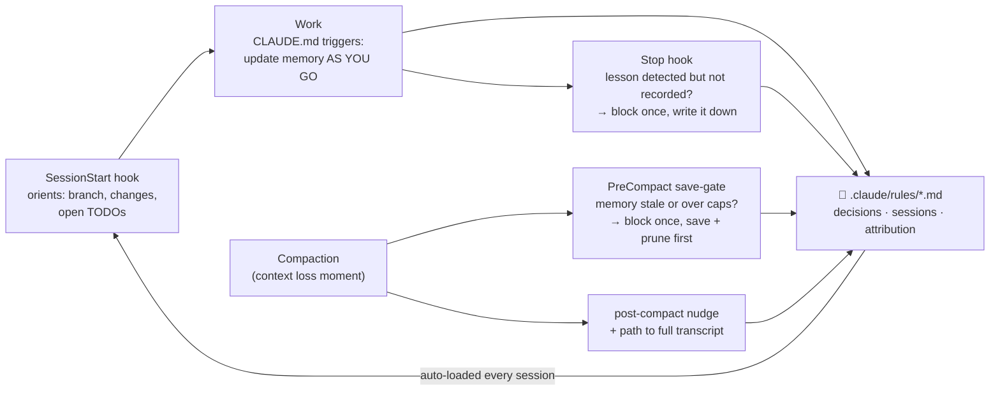

<div align="center">


# 🧰 Claude Skills

**A plugin marketplace for [Claude Code](https://claude.com/claude-code) — skills, slash commands, subagents, and battle-tested hooks.**

[](https://polyformproject.org/licenses/noncommercial/1.0.0)
[](https://code.claude.com/docs/en/plugins)
[](#-the-plugins)

Add the marketplace once — every plugin, and every update, is one `/plugin install` away.

</div>

---

## 🚀 Quick start

Inside any Claude Code session (CLI or VS Code extension):

```bash
# 1. Add this repository as a marketplace (once)
/plugin marketplace add alextimmer/claude-skills

# 2. Install whichever plugin(s) you want
/plugin install claude-memory-harness@claude-skills
/plugin install mbb-deck-plugin@claude-skills

# 3. Apply
/reload-plugins
```

Updates flow automatically: the plugins deliberately omit the `version` field, so every pushed commit counts as a new version — `/plugin marketplace update claude-skills` pulls the latest.

## 📦 The plugins

| Plugin | One-liner | Runs on |
|--------|-----------|---------|
| 🧠 [`claude-memory-harness`](plugins/claude-memory-harness/) | Give stateless Claude Code sessions a persistent, committable project memory | Claude Code only |
| 🔍 [`reviewing-prs`](plugins/reviewing-prs/) | Review PRs/MRs on Azure DevOps, GitHub and GitLab with verified, clickable, paste-ready findings and a hard approval gate | Claude Code only |
| 📊 [`mbb-deck-plugin`](plugins/mbb-deck-plugin/) | Build presentations the way top-tier consulting firms structure them | Claude Code + Claude.ai |

---

### 🧠 claude-memory-harness

> A fresh Claude Code session knows nothing about yesterday. This harness makes it **arrive already knowing the project** and **leave the project better documented than it found it** — with plain, committable files. No database, no server, no embeddings, no `jq`.



**What you get:**

- 📋 **`CLAUDE.md` template** — standing instructions with a memory trigger table ("update as you go, not at the end") and a TDD-mandatory workflow default
- 📓 **Three-file memory** — durable *decisions* (incl. "Ruled out" dead ends and a "Candidates" quarantine), a rolling *session log* with an "Open TODOs" micro-backlog and size caps, and a dated + attributed entry format (`## YYYY-MM-DD: Description [Agent]`) that keeps multi-agent workspaces auditable
- 🪝 **Three tested hooks** — SessionStart orientation (with cap audit + post-compaction flush), a block-once PreCompact save-gate that makes memory get written *before* compaction discards the details, and a block-once Stop reminder that reads the actual transcript
- ✅ **A 43-check self-test** — hook behavior is machine-verified, not asserted — plus a secret scan for memory files before they get committed
- 🤖 **The `memory-harness` skill** — say *"install my harness"* in any repo and Claude installs, adapts, and verifies the whole thing for you (asking first whether it should be team-shared or kept out of git via `.git/info/exclude`)

Installing the plugin adds the *installer* — your repos stay untouched until you ask for the harness in one of them. Design rationale for every choice lives in [`DECISIONS.md`](plugins/claude-memory-harness/DECISIONS.md); manual install and verification steps in [`INSTALL.md`](plugins/claude-memory-harness/INSTALL.md).

**Requirements:** bash + grep + sed (Linux/macOS: built-in; Windows: Git Bash — see the [plugin README](plugins/claude-memory-harness/README.md)).

---

### 📊 mbb-deck-plugin

> Build presentations in the structural style of top-tier management consulting firms: Pyramid Principle storylines, action titles, MECE structure, and minimal executive-grade visuals.

**What you get:**

- 🗂️ **`/storyline`** — develop a Pyramid-Principle storyline before any slide is written
- 🔍 **`/critique-deck`** — structured critique of an existing deck (six named review tests)
- 🤖 **Seven subagents** — including `storyline-reviewer` and `qa-reviewer` for adversarial review passes
- 🎨 **A complete skill** — slide patterns, visual style rules, palettes (plus a dense consulting-print profile), icons, and a `build_deck.py` renderer
- ✅ **Deterministic enforcement** — a storyline validator that auto-runs via hook the moment a storyline JSON is written, and `lint_deck.py`, which mechanically checks any finished `.pptx` (fonts, sizes, colors, alignment, page numbers — and the hard pie-chart ban) regardless of which renderer produced it

Also usable on **Claude.ai** — see below.

## 🌐 Using a skill on Claude.ai (without Claude Code)

Plugins marked *Claude Code + Claude.ai* expose a skill folder you can upload directly (Claude.ai → Customize → Skills → Upload). The uploadable folder is:

```
plugins/<plugin-name>/skills/<skill-name>/
```

Zip *just that folder* (the zip's root must be the skill folder itself, with `SKILL.md` directly inside). Pre-built zips may be attached to [Releases](https://github.com/alextimmer/claude-skills/releases).

> **Why not the memory harness?** Its skill installs files, wires hooks, and runs shell self-tests in a local repository — none of which exist on Claude.ai.

## 🗺️ Repository structure

<details>
<summary>Click to expand the annotated tree</summary>

```
claude-skills/
├── .claude-plugin/
│   └── marketplace.json          ← marketplace catalog (lists every plugin)
├── plugins/
│   ├── mbb-deck-plugin/          ← one plugin per folder
│   │   ├── .claude-plugin/
│   │   │   └── plugin.json
│   │   ├── agents/               ← subagents for this plugin (Claude Code only)
│   │   ├── commands/             ← slash commands (Claude Code only)
│   │   └── skills/
│   │       └── mbb-deck/         ← the actual skill — this is what gets uploaded to Claude.ai
│   │           ├── SKILL.md
│   │           ├── assets/
│   │           ├── examples/
│   │           ├── references/
│   │           └── scripts/
│   └── claude-memory-harness/    ← project memory harness (Claude Code only)
│       ├── .claude-plugin/
│       │   └── plugin.json
│       ├── template/             ← the payload the skill copies into target repos
│       │   ├── CLAUDE.md
│       │   └── .claude/          ← settings.json + hooks/ + rules/ (inert here; active once installed)
│       ├── skills/
│       │   └── memory-harness/   ← the installer/maintenance skill (SKILL.md + references/)
│       ├── INSTALL.md            ← human install guide
│       └── DECISIONS.md          ← design rationale (choice → why)
├── docs/                         ← repo-level docs + README assets (never ships with a plugin)
├── evals/
│   ├── mbb-deck/                 ← maintainer evals per skill (trigger-accuracy prompts)
│   └── memory-harness/
├── LICENSE
└── README.md
```

</details>

## 🛠️ For contributors & plugin authors

<details>
<summary>Adding a new plugin to this repo</summary>

1. Create `plugins/<new-plugin>/` with `.claude-plugin/plugin.json`, plus any `agents/`, `commands/`, and `skills/<skill>/` folders.
2. Add a new entry to the `plugins` array in `.claude-plugin/marketplace.json`.
3. (Optional) Create `evals/<skill-name>/` for trigger-accuracy tests.
4. Update this README's plugin table.
5. Validate, then commit. Users with the marketplace already added will see the new plugin immediately.

</details>

<details>
<summary>Validating before pushing</summary>

From the repo root:

```bash
claude plugin validate .
```

This catches naming errors, JSON parse issues, and frontmatter problems across all plugins. For the memory harness, additionally run its hook self-test:

```bash
bash plugins/claude-memory-harness/template/.claude/hooks/selftest.sh
# -> 43 passed, 0 failed
```

</details>

Issues and PRs welcome. If your issue concerns a specific plugin, mention the plugin in the title so I can route it.

## 📄 License

Licensed under the [PolyForm Noncommercial License 1.0.0](https://polyformproject.org/licenses/noncommercial/1.0.0).

You can use, modify, and distribute this software for any **noncommercial purpose** — personal use, hobby projects, study, research, education, charitable work, government use. See [`LICENSE`](LICENSE) for the full terms.

**Commercial use requires a separate license.** If you want to use this in a for-profit context (consulting work for paying clients, integration into a commercial product, internal use at a for-profit company beyond evaluation), please open an issue to discuss licensing terms.
