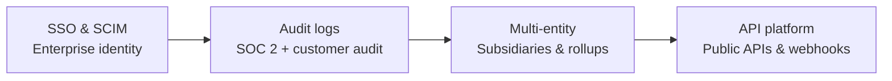
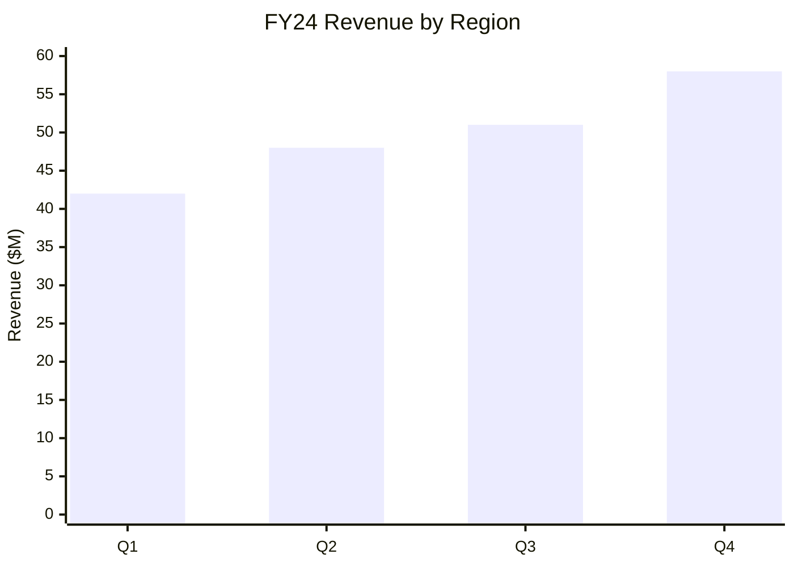
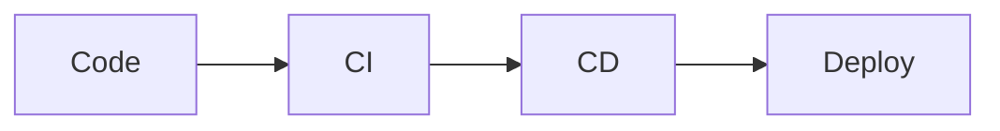

# Marp rendering reference

How to translate a storyline JSON (matching `assets/storyline_schema.json`) into clean Marp markdown that respects MBB visual conventions.

This document is the authoritative reference when the user picks Option B (Marp markdown) in `references/output-formats.md`. Read it fully before generating Marp output.

## Quick orientation

**Marp** = Markdown Presentation Ecosystem. Decks are written as `.md` files with a special YAML frontmatter and `---` separators between slides. Renders to HTML, PDF, or PPTX via the Marp CLI or VS Code extension.

**Marpit** = the framework Marp is built on. Most Marp syntax is actually Marpit syntax. When a feature is "Marp-only" it'll be called out below.

**Two ways to set directives:**
- **Frontmatter (YAML at the top)** — applies globally to the whole deck
- **HTML comments inside the slide** — applies locally to one slide or all subsequent slides

## File-level template — start every deck with this

```markdown
---
marp: true
theme: default
paginate: true
header: ''
footer: ''
size: 16:9
math: katex
style: |
  /* Optional: small global tweaks. Leave empty if not needed. */
---
```

Then `---` separators between slides. The first `---` after the frontmatter is the slide break for slide 1.

## Theme handling — user-provided, not bundled

This skill does NOT ship Marp themes. Themes vary too much between organizations to bundle one.

**If the user has their own theme file** (a `.css` file with `/* @theme name */` at the top):
- Tell them to register it with the Marp CLI (`marp --theme path/to/their-theme.css`) or the VS Code extension setting
- Use `theme: their-theme-name` in the frontmatter
- Don't try to inline the whole theme as `style:` — that defeats the point of having a theme

**If the user has no theme**:
- Use `theme: default` (Marp's built-in)
- For lightweight color customization, use `style: |` with CSS variables and overrides — this is the "small global tweaks" comment in the template above

**If the user wants navy/red/green/neutral palettes matching the Python script's output**:
- Tell them this skill ships those palettes for `build_deck.py`, not for Marp
- They can replicate the colors via inline CSS — see "Palette colors as inline CSS" below
- Or they can build their own theme file using the same hex values from `assets/palettes.json`

## Frontmatter directives — what each one does

| Directive | What it controls | Typical value |
|---|---|---|
| `marp: true` | Required. Tells Marp this file is a deck. | `true` |
| `theme:` | Theme name. Built-ins: `default`, `gaia`, `uncover`. Custom themes by name after registering them. | `default` |
| `paginate:` | Show page numbers. | `true` |
| `header:` | Text shown at top of every slide. Can include markdown. | `''` (none) or `'Project Acme'` |
| `footer:` | Text shown at bottom of every slide. | `'Source: Acme analysis'` |
| `size:` | Aspect ratio. `16:9` for widescreen, `4:3` for legacy. | `16:9` |
| `math:` | Math rendering. `katex` (faster) or `mathjax` (more features). | `katex` |
| `class:` | Apply theme-defined CSS class to ALL slides. Must be a list if multiple. | `invert` or `[invert, lead]` |
| `backgroundColor:` | Default background color hex. | `'#fff'` |
| `color:` | Default text color hex. | `'#333'` |
| `style:` | Inline CSS, applied to the whole deck. Use `|` for multi-line. | See template above |

## Per-slide directives — the underscore prefix

Two ways to apply a directive to **only the current slide** (not subsequent slides):

```markdown
<!-- _class: invert -->
<!-- _paginate: false -->
<!-- _backgroundColor: '#003A70' -->
```

The leading underscore is the "spot" or "scoped" prefix. **Without it, the directive applies to the current slide AND all following slides** until overridden.

Real example — title slide should not paginate:

```markdown
---
marp: true
paginate: true
---

<!-- _paginate: false -->

# Acme 2026 Strategy

## Recommendation to the Board

April 2026

---

# This slide WILL paginate (page 1)
```

## Slide separator — the rule

`---` on its own line separates slides. **Important:** Marp uses the FIRST TWO `---` rulers as the YAML frontmatter delimiters. From the third one onward, they're slide breaks.

```markdown
---
marp: true            <- frontmatter starts
theme: default
---                   <- frontmatter ends, slide 1 starts here

# Slide 1

---                   <- slide break, slide 2 starts here

# Slide 2
```

**Don't use `___` (three underscores) as a slide separator.** Some older guides do; standard Marp uses `---`.

## Mapping the storyline JSON to Marp

This is the core translation table. Each slide type in the schema becomes a specific Marp pattern.

### Title slide (`type: title`)

```markdown
<!-- _paginate: false -->
<!-- _class: lead -->

# Acme 2026 Growth Strategy

## Recommendation to the Board

**April 2026**
**Prepared for:** Acme Board of Directors
**Prepared by:** Strategy Team
```

Notes:
- `_paginate: false` so the title doesn't get a page number
- `_class: lead` works in the `default` theme to center content vertically (and similar in user themes that support it)
- H1 = deck title, H2 = subtitle. **Title slide is the one place it's OK to have multiple headers** because it's structural metadata, not content.

### Executive summary (`type: exec_summary`)

```markdown
# Acme should move upmarket to enterprise HR in 2026, funded by sunsetting SMB — adding $40M ARR over 24 months

##### Strategy team analysis · Acme financials FY24

1. **Growth has stalled** at 3% for two years while competitors grew 25%+
2. **The enterprise segment is $4.2B** and growing 18%, three times our TAM
3. **Two top-30 customers** already use us above 500 employees
4. **The product gap** to enterprise-ready is six features in three quarters
5. **The SMB tier costs $14M/year** and is contribution-margin negative

<!-- _footer: 'Source: Strategy team analysis; Acme financials FY24' -->
```

Notes:
- The H1 IS the action title (governing thought). One H1 per slide — this is the rule everywhere except the title slide.
- The framing line goes as `##### H5` immediately under the H1. Small, gray, methodology-flavored. (You can also use a paragraph with `*italic*` if your theme styles H5 oddly.)
- Bold the lead noun phrase of each supporting point so the eye picks them up.
- The source goes in the per-slide footer using `_footer:`.

### Bullets (`type: bullets`)

```markdown
# Growth has stalled at 3% for two years while three competitors have grown 25%+ by moving upmarket

##### Acme financials FY23–FY24 · Competitor 10-K filings

- Acme ARR has grown 3.1% in FY23 and 3.4% in FY24, vs. five-year average of 14%
- Three named competitors crossed $300M ARR by adding enterprise tiers since 2023
- Net revenue retention has fallen from 118% to 102% over the same period
- Customer count has grown, but average contract value has compressed by 11%

<!-- _footer: 'Source: Acme financials FY23–FY24; competitor 10-K filings' -->
```

Bullet rules:
- 3–5 bullets max
- Each starts with the same part of speech (parallel structure)
- Each bullet is a complete thought, not a fragment
- No nested bullets in MBB style — if you need hierarchy, split into two slides

### Two-by-two matrix (`type: two_by_two`)

Marp has no native 2x2 matrix. Use a grid layout with CSS:

```markdown
---
style: |
  .matrix {
    display: grid;
    grid-template-columns: 1fr 1fr;
    grid-template-rows: 1fr 1fr;
    gap: 0;
    border: 1px solid #999;
    height: 400px;
    margin: 1em 0;
  }
  .matrix > div {
    border: 1px solid #ccc;
    padding: 1em;
  }
---

# Three of our five product lines fall in the low-growth, low-margin quadrant

##### Acme product P&L FY24 · Market growth from Gartner 2024

<div class="matrix">
  <div>
    <strong>High margin, low growth</strong><br/>
    · Core HR
  </div>
  <div>
    <strong>High margin, high growth</strong><br/>
    · <strong style="color:#003A70">Talent</strong><br/>
    · <strong style="color:#003A70">Performance</strong>
  </div>
  <div>
    <strong>Low margin, low growth</strong><br/>
    · Payroll<br/>
    · Benefits
  </div>
  <div>
    <strong>Low margin, high growth</strong>
  </div>
</div>

X-axis: Market growth → · Y-axis: ↑ Acme contribution margin

<!-- _footer: 'Source: Acme product P&L FY24; market growth from Gartner 2024' -->
```

Notes:
- The CSS goes in `style:` global frontmatter so it applies to any 2x2 in the deck
- Use accent color (e.g., `#003A70` navy) on highlighted items, gray on the rest
- Axis labels go *below* the matrix as a single line — keeping it simple is better than absolute-positioned overlays

### MECE buckets (`type: mece_buckets`)

Use a multi-column grid (see "Multi-column layouts" below for the standard `.columns` pattern):

```markdown
# We evaluated four growth paths against three criteria; only enterprise expansion meets all three

##### Strategy team modeling, March 2026

<div class="columns-4">
<div>

### Enterprise expansion
Move upmarket to 500+ employee accounts
**$40M ARR**

</div>
<div>

### Geographic expansion
Enter EU and APAC markets
**$18M ARR**

</div>
<div>

### Product adjacency
Add learning management
**$22M ARR**

</div>
<div>

### M&A roll-up
Acquire two niche HR tools
**$30M ARR**

</div>
</div>

<!-- _footer: 'Source: Strategy team modeling, March 2026' -->
```

The `.columns-4` class needs to be in the deck-level `style:` — see the multi-column section below.

### Comparison table (`type: comparison`)

Use a standard markdown table. Highlight the recommended option with bold and color:

```markdown
# Enterprise expansion is the only option that scores high on market size, fit, and feasibility

##### Strategy team scoring, March 2026

| Criterion | **Enterprise** | Geographic | Product adjacency | M&A roll-up |
|---|---|---|---|---|
| Market size | **High** | Medium | Medium | Low |
| Strategic fit | **High** | Medium | High | Low |
| Feasibility (12mo) | **High** | Low | Medium | Low |
| Capital required | **Low** | High | Medium | Very High |
| Competitive risk | **Medium** | High | Medium | Medium |

▼ **RECOMMENDED**: Enterprise expansion

<!-- _footer: 'Source: Strategy team scoring, March 2026' -->
```

For more aggressive styling (colored cell backgrounds, recommended-column highlighting), use inline CSS:

```markdown
<style scoped>
  table th:nth-child(2),
  table td:nth-child(2) {
    background-color: #E8F0F7;
    font-weight: bold;
  }
</style>
```

`<style scoped>` applies CSS to **only the current slide**. Crucial trick — see the "CSS hacks and workarounds" section for the full set of patterns.

### Quote (`type: quote`)

```markdown
<!-- _class: quote -->

> "Acme has the best mid-market HR product we've used. The day they support our European subsidiaries, we'll triple our spend."

— **VP People, Top-10 Acme customer (1,200 employees)**

<!-- _footer: 'Source: Customer interview, Feb 2026' -->
```

If your theme has a `quote` class, use it. Otherwise scope CSS:

```markdown
<style scoped>
  blockquote {
    font-size: 1.5em;
    font-style: italic;
    border: none;
    text-align: center;
    margin-top: 2em;
  }
</style>
```

### Value chain (`type: value_chain`)

Two options.

**Option 1 — Mermaid diagram** (cleanest, but requires Mermaid setup):

````markdown
# The path to enterprise-ready spans four sequential capabilities, deliverable in three quarters

##### Engineering capacity plan, FY26



<!-- _footer: 'Source: Engineering capacity plan, FY26' -->
````

**Mermaid requires this script tag once in your deck** (anywhere, but typically at the very top below the frontmatter):

```html
<script type="module">
  import mermaid from 'https://cdn.jsdelivr.net/npm/mermaid@10/dist/mermaid.esm.min.mjs';
  mermaid.initialize({ startOnLoad: true });
</script>
```

Without that, Mermaid blocks render as code, not diagrams.

**Option 2 — Pure markdown columns** (works without Mermaid):

```markdown
# The path to enterprise-ready spans four sequential capabilities, deliverable in three quarters

##### Engineering capacity plan, FY26

<div class="columns-4">
<div>

### 1. SSO & SCIM
Enterprise identity integration

</div>
<div>

### 2. Audit logs
SOC 2 + customer audit support

</div>
<div>

### 3. Multi-entity
Subsidiaries and rollups

</div>
<div>

### 4. API platform
Public APIs and webhooks

</div>
</div>
```

### Roadmap (`type: roadmap`)

```markdown
# Implementation in three phases over 18 months, with the SMB sunset starting in Q2 2026

##### Implementation plan, March 2026

<div class="columns">
<div>

### Q2 2026 — Foundation
- SSO & SCIM in beta
- Begin SMB sunset comms
- Enterprise sales hires (3)

</div>
<div>

### Q3–Q4 2026 — Build
- Audit logs GA
- Multi-entity GA
- First 5 enterprise wins
- SMB tier off price list

</div>
<div>

### H1 2027 — Scale
- API platform GA
- 20 enterprise wins
- SMB sunset complete

</div>
</div>

<!-- _footer: 'Source: Implementation plan, March 2026' -->
```

### Section divider (`type: section`)

```markdown
<!-- _class: lead -->
<!-- _paginate: false -->

# Appendix
```

`_class: lead` centers content in most themes. `_paginate: false` skips the page number.

### Chart placeholder (`type: chart`)

Marp doesn't render charts natively. Three approaches:

**1. Pre-rendered image** (recommended for finished decks):

```markdown
# Combined: enterprise expansion adds $40M ARR by end-2027; sunsetting SMB frees $14M

##### Strategy team financial model, March 2026


Net new ARR of +$26M, plus $14M SMB cost savings = $40M EBITDA improvement.

<!-- _footer: 'Source: Strategy team financial model, March 2026' -->
```

**2. Mermaid for simple charts**:

````markdown

````

**3. Placeholder text** (early drafts):

```markdown
# Combined: enterprise expansion adds $40M ARR by end-2027

##### Strategy team financial model, March 2026

> [ Chart placeholder — Waterfall: FY25 ARR → +Enterprise → +Existing expansion → −SMB churn → FY27 ARR ]

Net new ARR of +$26M, plus $14M SMB cost savings = $40M EBITDA improvement.
```

## Multi-column layouts — the `.columns` pattern

Marp doesn't have a native multi-column directive. The community-standard pattern is a CSS grid in `style:` plus `<div class="columns">` in slides.

Add this to your deck's frontmatter `style:`:

```markdown
style: |
  .columns {
    display: grid;
    grid-template-columns: repeat(2, minmax(0, 1fr));
    gap: 1rem;
  }
  .columns-3 {
    display: grid;
    grid-template-columns: repeat(3, minmax(0, 1fr));
    gap: 1rem;
  }
  .columns-4 {
    display: grid;
    grid-template-columns: repeat(4, minmax(0, 1fr));
    gap: 1rem;
  }
```

Variants worth knowing:

```markdown
style: |
  /* Centered content in cells */
  .columns-center {
    display: grid;
    grid-template-columns: repeat(2, minmax(0, 1fr));
    gap: 1rem;
    justify-items: center;
    align-items: center;
  }

  /* Auto-width: first column sized to content, second fills remainder */
  .columns-fit {
    display: grid;
    grid-template-columns: auto 1fr;
    gap: 1rem;
  }
```

Then in any slide:

```markdown
<div class="columns">
<div>

## Left side
- Content

</div>
<div>

## Right side
- Content

</div>
</div>
```

**Critical formatting rule:** there must be **blank lines** around the inner `<div>` tags. Without blank lines, Marp doesn't parse the markdown inside as markdown — it treats it as raw HTML and bullets/headers don't render.

```markdown
<!-- WRONG — no blank lines, markdown won't render -->
<div class="columns">
<div>
## This stays as raw text
- bullet
</div>
</div>

<!-- RIGHT — blank lines preserved -->
<div class="columns">
<div>

## This renders as a heading

- bullet renders as a bullet

</div>
</div>
```

## Backgrounds and images

### Background image for the whole slide

```markdown

```

The `bg` keyword in the alt-text is the trigger.

### Sized backgrounds

```markdown
      <!-- fills the slide (default) -->
    <!-- fits inside the slide -->
        <!-- alias for contain -->
        <!-- scaling factor -->
```

### Split backgrounds — left/right

```markdown


# Slide content goes on the right side

The image takes the left half; text shrinks to the right half.

---


# Image takes only 35% on the right
```

This is the canonical "image on one side, text on the other" pattern.

### Image filters

```markdown


```

Combinable: ``

### Inline images (not background)

```markdown

              <!-- width 400px -->
              <!-- height 300px -->
        <!-- both -->
```

### Image alignment via alt-text keywords

A common theme convention — works only if the theme's CSS supports it (most do not by default; see the "CSS hacks" section below for the snippet to add it):

```markdown
            <!-- centered -->
             <!-- right-aligned -->
              <!-- left-aligned -->
```

## Mermaid diagrams — the right way

Mermaid is NOT enabled by default. To enable it:

**Step 1** — Add this script tag once anywhere in your `.md` file (typically right after the frontmatter):

```html
<script type="module">
  import mermaid from 'https://cdn.jsdelivr.net/npm/mermaid@10/dist/mermaid.esm.min.mjs';
  mermaid.initialize({ startOnLoad: true });
</script>
```

**Step 2** — Use fenced code blocks with the `mermaid` language:

````markdown

````

That's it. Don't mix the fence with `<div class="mermaid">` — it's one or the other, and the fenced version is more idiomatic.

**Optional sizing** — add to the frontmatter `style:`:

```markdown
style: |
  svg[id^='mermaid-'] {
    min-width: 480px;
    max-width: 960px;
  }
```

Mermaid types worth knowing for MBB-style decks:
- `flowchart LR` — value chains, process flows
- `flowchart TD` — top-down hierarchies
- `sequenceDiagram` — interaction flows (rarely used in strategy decks)
- `xychart-beta` — bar/line charts (limited but native, no PNG needed)

## Speaker notes

Marp uses HTML comments for speaker notes — but **only HTML comments without leading underscores or directive keywords**:

```markdown
# Slide title

Visible content here.

<!-- This is a speaker note — not visible on the slide. -->

<!--
Multi-line speaker
notes work too.
-->
```

**Watch out:** `<!-- _class: lead -->` is a directive, not a note. The leading underscore + recognized keyword (`class`, `paginate`, etc.) tells Marp it's a directive. Plain prose comments become notes.

To export with notes, use `marp --notes` in the CLI, or open the HTML output and press `P` for presenter mode.

## Footers and headers — three patterns

**Pattern 1 — Same footer on every slide** (set once in frontmatter):

```markdown
---
footer: 'Confidential · Internal'
paginate: true
---
```

**Pattern 2 — Per-slide footer for sources** (override per data slide):

```markdown
<!-- _footer: 'Source: Acme financials FY24' -->
```

**Pattern 3 — Reset to empty for special slides** (title slide, section dividers):

```markdown
<!-- _footer: '' -->
<!-- _paginate: false -->
```

Headers work the same way (`header:`, `_header:`, `_header: ''`).

You can include markdown in headers and footers — bold, italic, inline images, links — but wrap in quotes if you use special characters:

```markdown
header: '**Project Acme** | _Strategy Review_'
footer: ' Acme Confidential'
```

---

# CSS hacks and workarounds

Marp's defaults handle simple decks well, but anything resembling a real consulting deck — precise typography placement, special slide types, dense tables, custom pagination — needs CSS tricks. This section gathers the patterns that come up repeatedly.

**Read this principle first:** every hack below can be applied either as `<style scoped>` inside one slide or as a global rule in the deck's `style:` frontmatter. **If you find yourself using the same hack on every slide, move it into your theme file.** Inline CSS belongs in the markdown only when it's truly per-slide; recurring patterns belong in the theme. A theme file with these patterns baked in is durable; markdown with the same `<style scoped>` block copy-pasted on 30 slides is a maintenance trap.

## The `<style scoped>` technique — what it does and how it leaks

`<style scoped>` is the per-slide CSS escape hatch:

```markdown
# Slide with custom styling

<style scoped>
  section {
    background-color: #f0f0f0;
  }
  h1 {
    color: navy;
  }
</style>

Content here.
```

**What "scoped" means in Marp:** the CSS only applies to the slide that contains the `<style scoped>` block. The current slide gets a generated class (something like `[data-marpit-scope-xxxxx]`) appended to every selector inside the block, so the rules don't leak to other slides.

**What can leak anyway:**
- Pseudo-elements like `::before` and `::after` are scoped correctly.
- Global selectors targeting `body`, `html`, or the `:root` variable scope DO leak — those bypass the scoping mechanism. If you set `:root { --foo: bar }` inside `<style scoped>`, it affects every slide, not just this one.
- CSS counters declared inside `<style scoped>` may or may not reset across slides depending on Marp version. If you use counters, declare them once globally instead of scoped.

**When to use scoped vs global:**
- Scoped: a one-off override (bigger font on a single dense table slide, custom positioning for one agenda layout)
- Global: anything you'll use more than twice (column grids, palette colors, pagination format)

## Hack 1 — Vertical centering on title and section slides

Marp's default layout aligns slide content to the top. Title slides, section dividers, and quote slides usually want content centered vertically.

**Per-slide:**

```markdown
<!-- _class: lead -->
<style scoped>
  section { justify-content: center; }
</style>

# Big Centered Title

## Subtitle
```

**Better — global rule for any slide with a known class:**

```markdown
style: |
  section.lead,
  section.section-divider,
  section.quote {
    justify-content: center;
  }
```

Then any slide with `<!-- _class: lead -->` (or `section-divider` or `quote`) gets vertical centering. This is one of the patterns that should always live in your theme rather than be repeated per-slide.

## Hack 2 — Absolute-positioned headings for precise typography

Real consulting decks need the slide title in a specific spot — not wherever Marp's default layout puts it. The standard approach is to absolutely position H1 and H2 within the slide.

**Per-slide — when one slide needs custom title placement:**

```markdown
<style scoped>
  section { justify-content: flex-start; }
  h1 {
    position: absolute;
    top: 60px;
    left: 80px;
    right: 80px;
    font-size: 32pt;
    font-weight: bold;
  }
  h2 {
    position: absolute;
    top: 110px;
    left: 80px;
    right: 80px;
    font-size: 18pt;
    color: #555;
    font-weight: normal;
  }
</style>

# Action title

## Framing line
```

**Better — global rule that applies to all content slides:**

```markdown
style: |
  section h1 {
    position: absolute;
    top: 44px;
    left: 64px;
    right: 60px;
    font-size: 25pt;
    font-weight: bold;
    color: #333;
  }
  section h2 {
    position: absolute;
    top: 90px;
    left: 64px;
    right: 60px;
    font-size: 18pt;
    font-weight: normal;
    color: #666;
  }
```

This is the pattern that gives consulting decks their characteristic "title pinned to top-left, body in the open space below" look. It belongs in a theme file, not per-slide markdown.

**Watch out:** when H1 is absolutely positioned, it no longer takes up vertical space in the layout flow. Body content will start at the top of the slide and OVERLAP the title unless you add `padding-top` to `section`:

```markdown
style: |
  section {
    padding-top: 120px;  /* Push body below where the absolute H1 sits */
  }
  section h1 {
    position: absolute;
    top: 44px;
    left: 64px;
    /* ... */
  }
```

Tune the `padding-top` to match where your H1/H2 end vertically.

## Hack 3 — Hiding pagination, header, and footer on special slides

Different special-purpose slides need different combinations of hiding/showing. Three ways to control it.

**Way 1 — Per-slide directives (cleanest for one-offs):**

```markdown
<!-- _paginate: false -->
<!-- _header: '' -->
<!-- _footer: '' -->

# Title slide
```

**Way 2 — `_paginate: skip` to skip pagination but still increment the counter:**

```markdown
<!-- _paginate: skip -->

# This slide is unnumbered, but page numbers continue counting from here.
```

vs.

```markdown
<!-- _paginate: false -->

# This slide is unnumbered AND the next slide gets page 1.
```

`skip` is what you want when an interstitial divider shouldn't show its number but shouldn't reset the count either.

**Way 3 — CSS-based hiding for whole slide types:**

```markdown
style: |
  section.lead footer,
  section.lead header,
  section.lead::after {
    display: none !important;
  }

  section.section-divider footer,
  section.section-divider header,
  section.section-divider::after {
    display: none !important;
  }
```

Then any slide tagged `<!-- _class: lead -->` automatically loses its footer, header, and pagination counter. The `::after` selector is what targets the pagination text — Marp renders pagination as `section::after { content: attr(data-marpit-pagination) }`.

This is the right approach when you have a known set of "decorated" slide types where pagination shouldn't appear.

## Hack 4 — Background image margin workaround

Marp's `` syntax fills the entire slide edge-to-edge by default. If you want a margin around the background (e.g., for a logo or branded mark), there's no native syntax — Marpit explicitly does not support it.

**Workaround:** use the `data-marpit-advanced-background` attribute:

```markdown
style: |
  section[data-marpit-advanced-background] {
    padding: 5px;
  }
```

That gives a 5px breathing room between the background image and the slide edge. Adjust as needed.

**Alternative — scale the image instead:**

```markdown

```

Scaling to under 100% achieves a similar effect without needing CSS.

## Hack 5 — Font-size scaling for dense slides

Some slides need to fit more content than the default font sizes accommodate (data tables, OKR matrices, dense appendix slides). Two scales to know.

**Whole-slide scaling:**

```markdown
<style scoped>
  section {
    font-size: 0.7em;
  }
</style>

# OKR Status — Q3 2025

[dense content here]
```

This shrinks everything on the slide — bullets, tables, paragraphs — by 30%. Use sparingly; it sacrifices readability for density.

**Per-element fine-grained scaling:**

For a single element (one table, one paragraph) that needs to be smaller without affecting the rest of the slide:

```markdown
# Status

<span style="font-size: 10px">

| Project | Q1 | Q2 | Q3 | Q4 |
|---------|----|----|----|----|
| ... | ... | ... | ... | ... |

</span>
```

Wrap the element in a `<span>` (or `<div>` for block content) with an inline `font-size`. This is ugly but reliable — Marp respects inline styles inside markdown.

**Prefer:** put a class in your theme:

```css
.dense-table { font-size: 0.6em; }
```

Then use `<div class="dense-table">` in the markdown. Cleaner and reusable.

## Hack 6 — Removing link underlines on internal agenda links

Agenda slides typically link each item to its destination slide using markdown links: `[Section 1](#3)`. Marp's default styling underlines them on hover, which looks wrong on a clean agenda.

**Global rule:**

```markdown
style: |
  a:hover, a:active, a:focus {
    text-decoration: none;
  }
```

If you want underlines suppressed entirely (not just on hover):

```markdown
style: |
  a {
    text-decoration: none;
  }
```

Limit it to specific slide types if you want the default underline behavior elsewhere:

```markdown
style: |
  section.agenda a,
  section.agenda a:hover {
    text-decoration: none;
  }
```

## Hack 7 — Image background-color reset

Marp's themes sometimes apply a default white background to the `` element, which breaks transparent PNGs (you see a white box around the image instead of the image floating cleanly).

**Reset:**

```markdown
style: |
  img {
    background-color: transparent !important;
  }
```

The `!important` is needed because the theme's rule typically has higher specificity. Apply globally — there's no reason any image should have its container colored.

## Hack 8 — Custom "page N of M" pagination via CSS counters

Marp's `paginate: true` shows just the current page number. To show "N of M":

```markdown
style: |
  section::after {
    content: attr(data-marpit-pagination) ' / ' attr(data-marpit-pagination-total);
    font-size: 0.6em;
    color: #888;
  }
```

The `data-marpit-pagination` and `data-marpit-pagination-total` attributes are populated by Marp on every slide. Override the `::after` selector and you control the format.

**Common variants:**

```markdown
style: |
  /* "Page 5 of 12" */
  section::after {
    content: 'Page ' attr(data-marpit-pagination) ' of ' attr(data-marpit-pagination-total);
  }

  /* Just slash-separated, smaller, custom color */
  section::after {
    content: attr(data-marpit-pagination) ' / ' attr(data-marpit-pagination-total);
    font-size: 0.55em;
    color: #999;
  }
```

You'll also typically want to repeat the rule for `section.invert::after` if your inverted (dark) slides need a different color.

## Hack 9 — Theme-color overrides via CSS variables

The cleanest way to retheme an existing theme is to override its CSS variables in `:root`. Most well-built themes expose their colors as variables; you swap the values without touching the theme file.

```markdown
style: |
  :root {
    --color-primary: #003A70;     /* main accent */
    --color-secondary: #555555;   /* secondary text */
    --color-bg: #ffffff;           /* slide background */
    --color-text: #222222;         /* body text */
    --color-muted: #999999;        /* footer / pagination */
    --color-link: #003A70;
  }

  /* Then apply them */
  h1 { color: var(--color-primary); }
  h2 { color: var(--color-secondary); }
  footer, section::after { color: var(--color-muted); }
  a { color: var(--color-link); }
```

If you're starting from scratch (no theme), declaring variables this way and then writing rules against them is far easier to maintain than hardcoding hex codes throughout the deck.

**Watch out:** declaring `:root` variables inside `<style scoped>` may not actually scope them — `:root` is the document root, which is shared across all slides. Always declare variables in the global frontmatter `style:` rather than per-slide.

## Hack 10 — Per-slide background image via CSS instead of `![bg]`

Marp's `![bg]` syntax wraps the background image in a `<figure>` element and shrinks the content area to make room. Sometimes you want a background image WITHOUT the content shrinking — text or content overlaid directly on the image.

**Workaround — set the background via CSS instead of markdown:**

```markdown
<style scoped>
  section {
    background-image: url('path/to/image.jpg');
    background-size: cover;
    background-position: center;
    background-repeat: no-repeat;
  }
</style>

# Title overlaid on the image
```

The CSS approach treats the image as a true CSS background — content sits on top of it without layout interference. Useful for hero/title slides where you want maximum visual impact.

**Combine with overlay for legibility:**

```markdown
<style scoped>
  section {
    background-image:
      linear-gradient(rgba(0,0,0,0.5), rgba(0,0,0,0.5)),
      url('path/to/image.jpg');
    background-size: cover;
    color: white;
  }
</style>

# Title with dark overlay for legibility
```

The gradient layer dims the image so white text reads cleanly.

## Hack 11 — Per-slide class assignment for typed slides

Real decks have several distinct slide *types*: title, agenda, content, section divider, appendix. Each wants different layout. Two ways to assign a type.

**Way 1 — Per-slide directive:**

```markdown
<!-- _class: agenda -->

# Agenda

1. [Strategy](#3)
2. [Findings](#5)
3. [Recommendation](#10)
```

**Way 2 — Multiple classes:**

```markdown
<!-- _class: agenda invert -->
```

Assigns both `agenda` and `invert` classes. Useful when "invert" (dark theme) is one axis and slide type is another.

Then style each type globally:

```markdown
style: |
  section.agenda h1 {
    font-size: 50pt;
    /* ... */
  }
  section.agenda ol {
    list-style: none;
    /* ... */
  }

  section.title-slide {
    /* title slide layout */
  }

  section.section-divider {
    text-align: center;
    /* ... */
  }
```

This is how you build a theme that feels purpose-built rather than generic. The Marp default theme has only `lead` and `invert`; everything else is yours to define.

## Hack 12 — Header content as styled link or image

The `header:` directive accepts inline markdown, which means you can put a link or image up there:

```markdown
---
header: '[← Back to Agenda](#2)'
---
```

Then style it via:

```markdown
style: |
  section header {
    font-size: 14pt;
    color: #003A70;
    text-align: right;
  }
  section header a {
    color: inherit;
    text-decoration: none;
  }
  section.invert header,
  section.invert header a {
    color: white;
  }
```

The result: a small link in the corner of every slide that jumps back to the agenda. Useful for long decks.

## Hack 13 — Resetting the heading underline

Some Marp themes (including `default` in some versions) put a `border-bottom` underline on H1. To remove it:

```markdown
style: |
  h1 {
    border-bottom: none !important;
  }
```

Use only when the underline genuinely doesn't fit your design — sometimes it's a useful visual structure, sometimes it's noise.

## Hack 14 — Forcing the layout to align top instead of center

Marp's themes vary on whether the default layout is `flex-start` (top-aligned) or `center`. To force top-alignment globally:

```markdown
style: |
  section {
    justify-content: flex-start;
  }
```

This is the right baseline for content slides (action title at the top, body below). Override per-slide with `justify-content: center` for title and divider slides via `<style scoped>` or a `_class` rule.

## Hack 15 — Custom counter-based numbered list styling

For agendas or stepwise-numbered slides, replace the default `1. 2. 3.` with circled numbers, chevrons, or other ornaments. The pattern uses CSS counters:

```markdown
style: |
  section.agenda ol {
    list-style: none;
    counter-reset: agenda-item;
    padding-left: 0;
  }
  section.agenda ol li {
    counter-increment: agenda-item;
    padding-left: 2.5em;
    position: relative;
    margin-bottom: 0.5em;
  }
  section.agenda ol li::before {
    content: counter(agenda-item);
    position: absolute;
    left: 0;
    width: 1.8em;
    height: 1.8em;
    border-radius: 50%;
    border: 2px solid currentColor;
    text-align: center;
    line-height: 1.6em;
    font-weight: bold;
  }
```

Then in markdown:

```markdown
<!-- _class: agenda -->

# Agenda

1. Strategy
2. Findings
3. Recommendation
```

The numbers render as circled bullets. Adjust `border-radius`, sizing, and color to taste.

## When to move a hack into your theme

A rule of thumb: **if you find yourself applying the same `<style scoped>` block on more than two slides, move it into your theme file.**

The theme file is a `.css` file with `/* @theme name */` at the top. Once registered with Marp (`marp --theme path/to/theme.css` or via the VS Code extension setting `markdown.marp.themes`), the theme name becomes available in `theme:` frontmatter:

```markdown
---
marp: true
theme: your-theme-name
---
```

What goes in the theme:
- Color variables (`:root` declarations)
- Font choices
- H1/H2 positioning if you've absolutely positioned them
- Class definitions for slide types you use repeatedly (`.agenda`, `.section-divider`, `.title-slide`, `.appendix`)
- Pagination format
- Image alt-text alignment helpers
- Multi-column grid classes (`.columns`, `.columns-3`, `.columns-4`)

What stays per-slide:
- One-off positioning for an unusual slide that doesn't fit any existing class
- Specific overrides for a single dense table or chart placeholder
- Experimental styling you're testing before promoting to the theme

The migration path is usually:

1. Start with `<style scoped>` on one slide
2. Copy it to a second slide → notice you're copying
3. Move it to global `style:` in frontmatter
4. Notice you're copying the global `style:` block between decks
5. Move it to a theme file

Step 5 is when the theme actually pays for itself — every new deck inherits the patterns automatically.

## Palette colors as inline CSS

If the user wants to match the four palettes from `assets/palettes.json` without writing a full theme:

```markdown
style: |
  /* Navy palette (McKinsey-inspired) */
  :root {
    --accent: #003A70;
    --body-text: #333333;
    --footnote: #888888;
    --neutral-light: #DDDDDD;
  }
  h1 {
    color: var(--accent);
  }
  h5 {
    color: #555555;
    font-size: 0.7em;
    font-weight: normal;
    margin-top: -0.5em;
  }
  footer {
    color: var(--footnote);
    font-size: 0.6em;
  }
```

Swap the `--accent` value for other palettes:
- Red (Bain-inspired): `#CC0000`
- Green (BCG-inspired): `#00543D`
- Neutral: `#333333`

## The visual-style rules from this skill — applied to Marp

These mirror `references/visual-style.md` but adapted for Marp specifically:

| Rule | How to enforce in Marp |
|---|---|
| One H1 per slide (the action title) | Don't add a second `#` heading. The title is `#`. Body uses `##` and below. |
| Action title in accent color | `style:` global CSS: `h1 { color: #003A70; }` |
| Framing line below title | `##### one line of methodology/scope` directly under the H1 |
| Source bottom-left | `<!-- _footer: 'Source: ...' -->` |
| Page number bottom-right | `paginate: true` in frontmatter |
| No 3D charts, gradients, drop shadows | Don't add CSS effects. Use flat colors only. |
| Generous whitespace | Avoid cramming. If the slide feels full, split it. |
| No more than 4 series on a chart | Same rule as `build_deck.py` — applies to Mermaid xychart and embedded images |

## Anti-patterns specific to Marp

- **Multiple H1s on one slide.** Each `#` should be a separate slide. If you need a sub-claim, use `##`.
- **Mixing slide separators.** Use `---` consistently. Don't switch to `___` mid-deck.
- **Putting markdown directly inside `<div>` without blank lines.** It won't render. Always blank-line around inner divs in column layouts.
- **Forgetting `_paginate: false` on the title slide.** It paginates as page 1 unless explicitly disabled.
- **Using `<!-- comment -->` near a slide break.** Marp may interpret it as a directive for the slide above OR below depending on placement. Place comments cleanly inside the slide they belong to.
- **Inline themes via huge `style:` blocks.** Fine for small tweaks, awful for full themes. Tell the user to put a real theme in a `.css` file.
- **Mermaid without the script tag.** Renders as code, not a diagram. Always include the script tag once.
- **Forgetting to escape special chars in YAML frontmatter.** Wrap header/footer values containing `:` `&` `*` `'` in quotes.
- **Repeating the same `<style scoped>` on every slide.** Move it into the global `style:` frontmatter or a theme file. Per-slide CSS is for one-offs only.
- **Declaring `:root` variables inside `<style scoped>`.** They won't scope. Put them in global frontmatter `style:` instead.
- **Setting `position: absolute` on H1 without adjusting `section { padding-top }`.** Body content overlaps the title.
- **Using `!important` everywhere defensively.** It works but stacks badly when themes also use it. Prefer specificity (e.g., `section h1` instead of just `h1`) before reaching for `!important`.

## A complete minimal example

```markdown
---
marp: true
theme: default
paginate: true
size: 16:9
style: |
  /* Palette */
  :root {
    --accent: #003A70;
    --muted: #888;
  }
  /* Title sizing and color */
  h1 { color: var(--accent); }
  h5 { color: #555; font-size: 0.7em; font-weight: normal; margin-top: -0.5em; }
  /* Pagination format */
  section::after {
    content: attr(data-marpit-pagination) ' / ' attr(data-marpit-pagination-total);
    color: var(--muted);
    font-size: 0.6em;
  }
  /* Lead/section slides — center, no pagination */
  section.lead, section.section-divider {
    justify-content: center;
    text-align: center;
  }
  section.lead::after, section.section-divider::after,
  section.lead footer, section.section-divider footer {
    display: none;
  }
  /* Multi-column grid */
  .columns { display: grid; grid-template-columns: 1fr 1fr; gap: 1rem; }
  .columns-3 { display: grid; grid-template-columns: repeat(3, 1fr); gap: 1rem; }
  /* Image transparency reset */
  img { background-color: transparent !important; }
  /* Link underline reset on hover */
  a:hover, a:active, a:focus { text-decoration: none; }
---

<!-- _paginate: false -->
<!-- _class: lead -->

# Acme 2026 Growth Strategy

## Recommendation to the Board · April 2026

---

# Acme should move upmarket to enterprise HR in 2026, funded by sunsetting SMB — adding $40M ARR over 24 months

##### Strategy team analysis · Acme financials FY24

1. **Growth has stalled** at 3% for two years
2. **Enterprise segment is $4.2B**, growing 18%
3. **Two top-30 customers** already exceed 500 employees
4. **Product gap is six features**, three quarters of work
5. **SMB tier costs $14M/year** at negative contribution margin

<!-- _footer: 'Source: Strategy team analysis; Acme financials FY24' -->

---

# Three of our five product lines fall in the low-growth, low-margin quadrant

##### Acme product P&L FY24

<div class="columns">
<div>

### High margin, low growth
- Core HR

### Low margin, low growth
- Payroll
- Benefits

</div>
<div>

### High margin, high growth
- **Talent**
- **Performance**

### Low margin, high growth
- (none)

</div>
</div>

<!-- _footer: 'Source: Acme product P&L FY24' -->

---

<!-- _class: section-divider -->

# Appendix
```

This minimal example exercises about half of the hacks in this document and produces a deck that already feels "consulting-grade" — clean palette, custom pagination, vertical centering on the title and section slides, no decorative chrome. Add more class definitions as you encounter slide types that don't fit `lead`, `section-divider`, or default content.

## Resources for the user

If they want to learn more or extend their setup:
- Marp homepage: marp.app
- Marpit (the underlying framework): marpit.marp.app
- VS Code extension: search for "Marp for VS Code" — gives live preview
- Marp CLI: `npm install -g @marp-team/marp-cli` then `marp deck.md` to render

## What this skill does NOT do for Marp

- **Does not bundle themes.** Themes vary too much by org. The user provides theirs.
- **Does not provide a `build_marp.py` script.** Claude generates Marp markdown directly from the storyline JSON in conversation. No tooling needed.
- **Does not auto-detect the user's Marp setup.** When in doubt, ask whether they're using VS Code extension, CLI, or another renderer — the rendering is identical, but their export workflow differs.
